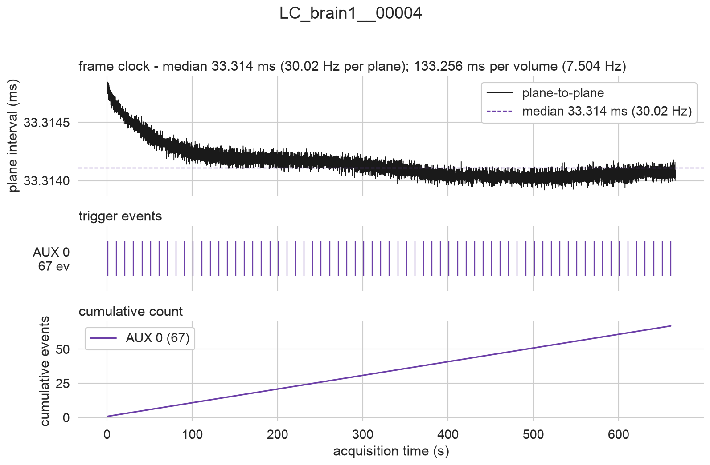

# scanimage-octo-reader

[](https://github.com/horsto/scanimage-octo-reader/actions/workflows/ci.yml)
[](pyproject.toml)
[](LICENSE)
[](https://github.com/astral-sh/ruff)

Inspect ScanImage TIFF timeseries from the command line: export structured
metadata as JSON, unpack the per-page **AUX trigger** and **I2C** records that
vDAQ writes into every frame header, plot the acquisition timeline, and check
for dropped frames.

`tifffile` is the only TIFF reader used - no `scanreader`, no
`ScanImageTiffReader`, no MATLAB.

## Why

ScanImage stores metadata in two very different places:

1. A **global header** - ~425 dotted `SI.*` keys in the TIFF `Software` tag,
   plus the mROI/scanfield description as JSON in `Artist`. Written once.
2. A **per-page header** in each page's `ImageDescription` - frame numbers,
   frame timestamps, and the vDAQ-recorded `auxTrigger0-3` timestamps and
   `I2CData` packets.

Anything recorded in parallel with imaging (a stimulus TTL, a treadmill
readout, licks) lives only in that second layer, spread across every page of
the file. Recovering it means sweeping all of them - which is cheap, because
only tags are read, never pixel data: a 10 GB, 20 000-page file sweeps in
about a second.

## Install

Into a dedicated environment (recommended!):

```bash
conda create -n scanimage-octo-reader python=3.11
conda activate scanimage-octo-reader
pip install "git+https://github.com/horsto/scanimage-octo-reader.git"
```

For development, clone and install in editable mode with the test tooling:

```bash
git clone https://github.com/horsto/scanimage-octo-reader.git
cd scanimage-octo-reader
pip install -e '.[dev]'
```

## Quickstart

```bash
# What is in this file?
socto info LC_brain1__00001.tif

# Everything: metadata, frame table, triggers, overview plot, manifest
socto export LC_brain1__00001.tif

# Just one thing
socto metadata *.tif
socto triggers --decode-i2c *.tif
socto plot --format pdf LC_brain1__00001.tif

# Look at raw per-page headers, or check for dropped frames
socto pages LC_brain1__00001.tif --start 100 --stop 110
socto check *.tif        # exits non-zero if any file has errors
```

Output is written **next to the TIFF being processed**, in a subfolder named
after it - so the export travels with the data rather than landing wherever
the command happened to be run. Pass `-o/--out DIR` to put it elsewhere.

`socto` on its own prints the help menu. Every subcommand takes multiple
files, and `--acquisition/-a` merges the sibling files of a split acquisition
(`<base>_<acq>_<index>.tif`) into one continuous timeline.

`socto info` on a sample recording:

```
                             LC_brain1__00001
files        LC_brain1__00001.tif
ScanImage    2022.1.0
scanner      Sutter_MOM_RG (RG)
epoch        2026-08-03T12:35:19.847000
pages        20000
frame size   [512, 512] int16
channels     1 [1]
volumes      5000 x 3 slice(s), 4 pages each (1 flyback, 1 frame(s)/slice)
z positions  [4087.75, 4077.75, 4067.75]
frame rate   30.0115 Hz
volume rate  7.50287 Hz
duration     666.344 s
AUX0         67 events, median interval 9.99998 s, 3.439-663.5 s
I2C          no packets
```

## Output layout

One directory per recording, named after the TIFF stem (or the shared stem of
a merged acquisition). `<out>` defaults to the directory containing the TIFF:

```
<out>/<name>/
  metadata.json              global metadata, summary, trigger inventory
  frames.npy                 structured per-page table
  aux/aux0.npy .. aux3.npy   one table per non-empty AUX line
  i2c/packets.npy            packet timing + frame context + payload length
  i2c/payloads.npy           zero-padded uint8 payload matrix
  i2c/packets_raw.json       verbatim source strings
  i2c/decoded_<key>.npy      optional '<key>_<value>' decode
  plots/overview.png         frame timeline + trigger overview
  plots/overview.pdf         same figure as vector art, text still editable
  manifest.json              what was written, plus the QC report
```

Everything loads with a bare `numpy.load` - fixed dtypes, no pickled objects:

```python
import numpy as np

frames = np.load("exports/LC_brain1__00001/frames.npy")
aux0 = np.load("exports/LC_brain1__00001/aux/aux0.npy")

print(frames["frame_timestamp_s"][:5])
print(aux0["timestamp_s"], aux0["frame_number"], aux0["volume_index"])
```

### `frames.npy`

One row per TIFF page: `page_index`, `frame_number`, `acquisition_number`,
`frame_number_acquisition`, `frame_timestamp_s`, `acq_trigger_timestamp_s`,
`next_file_marker_timestamp_s`, `end_of_acquisition`,
`end_of_acquisition_mode`, `dc_over_voltage`, `channel`, `slice_index`,
`frame_repeat_index`, `volume_index`, `volume_timestamp_s`, `is_flyback`,
`n_aux0`...`n_aux3`, `n_i2c`, `file_index`.

Missing or unreadable entries are `NaN` (floats) or `-1` (integers).
`slice_index` and `frame_repeat_index` are `-1` on flyback pages, which belong
to no Z position. `volume_timestamp_s` is the timestamp of the volume's first
page, shared by every page of that volume (flyback included).

### AUX tables

One row per detected trigger: `timestamp_s`, `page_index`, `frame_number`,
`frame_timestamp_s`, `offset_in_frame_s`, `volume_index`,
`volume_timestamp_s`, `offset_in_volume_s`, `slice_index`, `channel`,
`file_index`. Each event therefore carries the frame it was logged in - the
entire reason ScanImage writes these per page rather than globally.

**Plane time vs volume time.** `timestamp_s` is the FPGA timestamp of the
trigger itself, good to the sample period. Which reference you compare it
against depends on the analysis:

- `offset_in_frame_s` places the event inside the *plane* being scanned.
- `offset_in_volume_s` places it inside the *volume*, which is the timeline
  per-cell activity actually lives on: a given neuron is revisited once per
  volume, not once per plane. For the sample recording that is 133.3 ms, not
  33.3 ms.

For a single-plane acquisition the two coincide. Note that a trigger can land
on a flyback page (`slice_index == -1`): it still belongs to a volume, and
`volume_index` / `offset_in_volume_s` remain meaningful. In the sample
recording the 10 s stimulus is not an integer multiple of the volume period,
so successive triggers fall on different planes (`slice_index` cycles through
`-1, 0, 1, 2`) and drift steadily in `offset_in_volume_s` - worth knowing
before assuming a fixed stimulus phase within the volume.

### I2C tables

`i2c/packets.npy` holds `timestamp_s`, the same frame and volume context as
the AUX tables (including both offsets), plus `valid`, `payload_length` and
`payload_kind` (`b"bytes"` or `b"text"`). Payloads themselves are of
variable length, so they live in `i2c/payloads.npy` as a zero-padded `uint8`
matrix - trim each row with its `payload_length`. `--decode-i2c` additionally
writes one table per key for the `'<key>_<value>'` string convention (e.g.
`treadmill_9`), but only if *every* payload matches it; a partial decode would
be quietly misleading.

Negative I2C timestamps are ScanImage sentinels rather than data. They are
exported with `valid=False` instead of being dropped, so filtering stays your
decision.

### Metadata JSON

Sections: `tool`, `source`, `summary`, `triggers`, `warnings`, `scanimage`
(the `SI.*` tree plus `RoiGroups`), `tiff_tags`. `--flat` keeps the `SI.*`
keys exactly as ScanImage wrote them.

JSON has no literal for `inf`/`NaN`, which real headers do contain (e.g.
`SI.hBeams.lengthConstants = inf`), so non-finite values are written as the
strings `"Infinity"`, `"-Infinity"` and `"NaN"`. The convention is declared in
`tool.nonfinite_encoding`, and output is verified with `allow_nan=False`, so it
is always strictly valid JSON.

## Plots



*`socto export LC_brain1__00004.tif` - 20 000 pages, 5000 volumes of 3 slices,
with 67 stimulus triggers on AUX 0.*

`plots/overview.png` has three panels on a shared time axis:

1. **Frame interval** vs time, with the median marked, and the volume period
   named in the panel title - dropped frames and clock drift are visible
   immediately. In the figure above the resonant scanner is still settling for
   the first few minutes, drifting well under a microsecond per frame.
2. **Trigger raster**, one row per non-empty AUX line plus I2C. A line with
   thousands of events (ScanImage will happily log a trigger on *every* frame)
   switches automatically to a binned event-rate trace instead of a solid
   block.
3. **Cumulative event count** - a regular stimulus train is a straight line;
   a dropout is a kink.

Every figure is written twice: `overview.png` to look at, and `overview.pdf`
for dropping into a figure. 

## Quality control

`socto check` reports, and exits non-zero on errors:

- frame-number gaps (dropped frames, or a non-contiguous file selection)
- non-monotonic, negative or unreadable frame timestamps
- frame-interval jitter (warning above 1 % of the median, error above 10 %)
- volume-interval jitter, on the same thresholds
- the volume rate implied by the timestamps disagreeing with the header's
  `scanVolumeRate` by more than 1 %
- page counts that are not a whole number of volumes
- page-header key-set changes mid-recording, and unknown header keys
- `dcOverVoltage` frames, whose pixel data may be clipped
- a missing end-of-acquisition flag (possibly aborted or incomplete)

The report's `stats` carry both sampling rates measured from the data:
`implied_frame_rate_hz` (planes) and `implied_volume_rate_hz` (volumes), plus
their median intervals and jitter.

## Notes on the format

Things this tool handles that are easy to get wrong:

- **Stale slice counts.** Volumetric layout comes from
  `hStackManager.actualNumSlices` / `numFramesPerVolume` /
  `numFramesPerVolumeWithFlyback`, gated on `hStackManager.enable` /
  `hFastZ.enable` - never from `numSlices`, which can be a leftover from an
  earlier configuration (a sample file says 11 while actually recording 3).
- **Page order.** Channels vary fastest; `framesPerSlice` repeats sit inside a
  Z position; flyback is a single frame at the end of a whole volume, not per
  slice.
- **AUX separators.** ScanImage 2022.x writes `[3.439188320 ]` (spaces), older
  versions use commas. Both parse.
- **I2C flavours.** Both `I2CStoreAsChar` forms are supported, including a
  single packet (`{{1.5, [255]}}`), which `tifffile.matlabstr2py` flattens into
  something indistinguishable from a two-element list.
- **Split acquisitions.** Frame numbers and timestamps run continuously across
  the files of one acquisition, so merging concatenates without renumbering.
  Siblings are confirmed by comparing their global headers, not just names.
- **Page counts.** `tifffile` can report one page fewer than a classic
  (non-BigTIFF) SI-style file actually contains. Losing the last frame
  silently would be nasty, so the IFD chain is followed past the reported end;
  anything recovered is included and flagged in the QC report. The large
  BigTIFF files produced in practice are unaffected.

## Library use

```python
from scanimage_octo_reader import check_recording, read_recording

recording = read_recording("LC_brain1__00001.tif")  # or merge_acquisition=True
print(recording.summary())
print(recording.trigger_summary())

aux0 = recording.aux[0]["timestamp_s"]  # trigger times, seconds
report = check_recording(recording)
print(report.ok, [issue.message for issue in report.issues])
```

## Development

```bash
pytest                  # synthetic ScanImage TIFFs; fast, no large files needed
ruff check . && ruff format --check .
```

Tests build small TIFFs with the same tag structure as real ScanImage output,
covering single-plane, volumetric-with-flyback, multi-channel, both AUX
separator conventions, both I2C flavours, split acquisitions, and headers
containing `inf`. To additionally run the checks that pin down real-file
behaviour:

```bash
SOCTO_TEST_DATA=~/Downloads/schuham_light_stim_tif pytest
```
